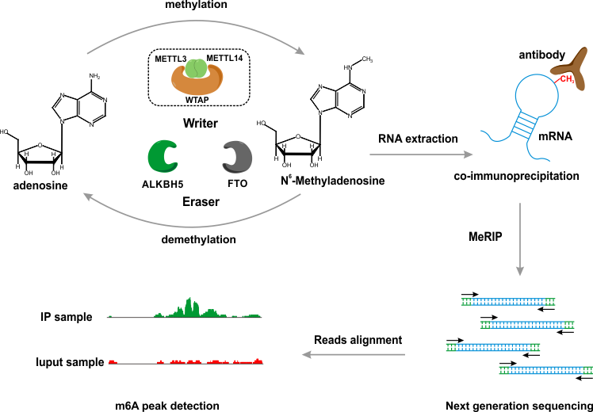

## Contents

- [Introduction](#introduction)
- [System Requirements](#system-requirements)
- [Installation Guide](#installation-guide)
- [Usage](#usage)
- [Demo](#demo)
- [Note](#note)
- [Contact](#contact)

<br>

<br>

## Introduction
#### Identify m6A peak at single-nucleotide-resolution
MATK is specifically designed for the detection of m6A peaks from MeRIP-seq 
experiment at single-nucleotide-resolution. The application of Variational 
Autoencoder achieved a far more accurate derivation of m6A peaks comparing 
to the state-of-art methods. Additionally, MATK also deploys a convolutional 
neural network model to identify m6A sites from the detected peaks, enabling 
a single-nucleotide-resolution peak calling.



#### Variational Autoencoder for peak calling
In order to identify regions that contain m6As, the algorithm first divides 
the entire genome into a set of mutually connected bins. According to Audic's 
model, the chromosomal bins are then parameterized into a set of vectors. For 
m6A peak calling, the VAE model is built and trained to fit the probability 
distribution of the input vectors.


#### Convolutional neural network for m6A sites prediction
To improve the resolution for m6A peak calling, we constructed a convolutional 
neural network model to predict precise m6A sites from peak regions. Combining 
the primary sequence feature and the MeRIP-seq coverage information, a robust 
prediction model was built. After evaluation by real dataset and qPCR experiment, 
the model is proved to be accurate in MeRIP-seq analysis.


#### A Bayesian hierarchical model for quantifying m6A level
Unlike DNA methylation, the quantification of epigenetic modification on RNA molecules 
may be significantly influenced by the expression level of RNA transcripts. As such, 
when designing quantification model for m6A events, certain cautions must be paid to 
the basal expression of the tested transcript. To address this issue, we developed a 
Bayesian hierarchical model to eliminate the effect of basal expression and quantify 
the true m6A level by Markov Chain Monte Carlo sampling.


<br>

<br>

## System Requirements

#### Hardware Requirements

The `matk` package requires only a standard computer with enough RAM to support the operations
defined by a user. For minimal performance, this will be a computer with about 4 GB of RAM.
For optimal performance, we recommend a computer with the following specs:

RAM: 8+ GB
CPU: 2+ cores, 3.3+ GHz/core

The runtimes below are generated using a computer with the recommended specs (8 GB RAM, 2 cores @3.3 GHz).

### Software Requirements

Users should install [Java Runtime Environment (JRE)](https://www.oracle.com/technetwork/java/javase/downloads/index.html) prior to using MATK.

### OS Requirements

The 'matk' package is a platform-independent software. The development version is 
tested on three operating systems.The developmental version of the package 
has been tested on the following systems:

Linux: CentOS 7.2.1511; 
<br>
Mac OSX: Mojave 10.14; 
<br>
Windows: Windows 10.

<br>

<br>

## Installation Guide

Instead of installing the package on your system, users can simply run the package with commandline. 
More details are shown in Usage.

<br>

<br>

## Usage
#### Basic command
```
java -jar MATK-1.0.jar [command] [options]
```

There are five commands available in MATK.

| Command | Description |
|---|---|
| -h  | Show the help page of MATK |
| -peakCalling  | Perform peak calling for MeRIP-seq data |
| -singleNucleotide  | Predict single-nucleotide-resolution m6A sites <br> from MeRIP-seq data|
| -quantification  | Quantify true m6A level from MeRIP-seq data |
| -diff  | Identify differential m6A level by comparing <br> between two given conditions |

<br>

#### Peak calling
This is the main function in MATK. Peak calling will perform on a pair of IP/Input sample.

- **Mandatory parameters**

```
-ip
```

This option will set the IP samples for peak calling. Only BAM format is supported. 
Multiple replicates should be separated by semicolon.

```
-input
```

This option will set the Input samples for peak calling. Only BAM format is supported. Multiple 
replicates should be separated by semicolon.

```
-out
```

Indicate the location of result file. MATK will save the peak calling results in this file.

- **Optional parameters**

```
-q
```

The identification threshold for peak calling. MATK use a generalized Pareto distribution (GPD) 
to filter out peaks that are significantly enriched in the IP sample. This parameter indicate a 
screening criterion. The default value is set to 0.05. Usually, this parameter can be set from 
0.05 to 0.01.

```
-c
```

This parameter is only valid under multiple replicates. It indicate a minimum number of samples 
that support a given region to be a true m6A peak. Default is 2. The value should be set between 
1 and J. Where J is the number of replicates applied in the experiment.

```
-technicalRep
```

Whether the experiment is technical replicates or biological replicates. Sets as true for technical 
replicates, and false for biological replicates. Default is false. If technical replicate is chosen, 
MATK will use a more stringent strategy to combine peaks from different replicate samples.

```
-gtf
```

Sets the gene set annotation for peak calling. If the gtf file is provided, MATK will perform annotation
 on the identified peaks. GTF file can be download in our [website](http://matk.renlab.org) or in [ENSEMBL](http://asia.ensembl.org/info/data/ftp/index.html) .

<br>

<br>

#### Single-nucleotide-resolution prediction
This option use a CNN model to predict single-nucleotide-resolution sites from the provided peak regions.
- **Mandatory parameters**

```
-ip
```

Sets the IP samples. The same as in peak calling options. Only valid in "MeRIP" mode.

```
-input
```

Sets the input samples. The same as in peak calling options. Only valid in "MeRIP" mode.

```
-bed
```

Sets the m6A peaks obtained from MeRIP-seq experiment. Use the peak calling command in MATK can produce this file. 
The m6A peaks should be stored in [BED](http://www.genome.ucsc.edu/FAQ/FAQformat.html#format1) format.

```
-fasta
```

Sets the input file in [FASTA](https://en.wikipedia.org/wiki/FASTA_format) format. Only valid in "Fasta" mode.


```
-out
```

Sets the output path. The predicted single-nucleotide-resolution sites will be saved in [BED](http://www.genome.ucsc.edu/FAQ/FAQformat.html#format1) format.

```
-2bit
```

Sets the genomic sequence in 2bit format. The 2bit file for human and mouse genome can be downloaded in 
our [website](http://matk.renlab.org), or generated by faToTwoBit program in [UCSC toolkit](http://hgdownload.soe.ucsc.edu/admin/exe/).

- **Optional parameters**

```
-sp
```

Sets the species. Currently, only human and mouse are provided. Should be "Human" or "Mouse". Default is "Human".

```
-t
```

Sets the prediction threshold. Should be "High", "Medium" or "Low". Default is "High".

```
-mode
```

Prediction mode. "MeRIP", "Sequence" or "Fasta" mode. Default is "MeRIP". MATK can use primary sequence 
feature or MeRIP-seq coverage information to predict precise m6A sites. The"Sequqnce" mode use only primary 
sequence feature to predict m6A sites. It may introduce false positives in the prediction, but will be 
much faster in computation. The "MeRIP" mode use both the primary sequence and MeRIP-seq coverage to predict 
m6A sites. Generally, this mode will be more accurate than the "Sequence" mode, but will cost more computational 
resources. When predicting m6A sites from a [FASTA](https://en.wikipedia.org/wiki/FASTA_format) file, the "Fasta" mode can be used. Only primary sequence 
feature will be used. 

```
-gtf
```

Sets the gene set annotation for m6A site prediction. If the gtf file is provided, MATK will perform annotation on 
the predicted sites. This option can help users to filter out low-confident sites that are located outside known 
transcripts. GTF file can be downloaded in our [website](http://matk.renlab.org) or in [ENSEMBL](http://asia.ensembl.org/info/data/ftp/index.html).

<br>

<br>

#### Quantification of m6A level
This option use a Bayesian hierarchical model to quantify true m6A level from MeRIP-seq data. The basal expression 
level for a given transcript is estimated by MCMC process, and eliminate from the methylation level.

- **Mandatory parameters**

```
-ip
```

Sets the IP samples. The same as in peak calling options.


```
-input
```

Sets the input samples. The same as in peak calling options.

```
-bed
```

Sets the m6A peaks obtained from MeRIP-seq experiment. Should be stored in BED format.

```
-out
```

Sets the output path. The quantification result will be saved in BED format.

```
-gtf
```

Sets the gene set annotation for quantification analysis. Should be in GTF format.

- **Optional parameters**

```
-iteration
```

Sets the iteration time for MCMC algorithm. Default is 10000.

```
-burn_in
```

Sets the burn-in time for MCMC algorithm. Should be smaller than the iteration time. Default is 9000.

<br>

<br>

#### Differential m6A sites dectection
This option compares the m6A level between two given experimental conditions. An empirical test is performed 
based on the quantification results.

- **Mandatory parameters**

```
-control_ip
```

Sets the IP samples of control condition.

```
-control_input
```

Sets the input samples of control condition.

```
-control_bed
```

Sets the m6A peaks obtained from control MeRIP-seq experiment. Should be stored in BED format.

```
-treated_ip
```

Sets the IP samples of treated condition.

```
-treated_input
```

Sets the input samples of treated condition.

```
-treated_bed
```

Sets the m6A peaks obtained from treated MeRIP-seq experiment. Should be stored in BED format.

```
-out
```

Sets the output path. The differential m6A events will be saved in tsv format.

```
-gtf
```

Sets the gene set annotation for differential analysis. Should be in GTF format.

- **Optional parameters**

```
-iteration
```

Sets the iteration time for MCMC algorithm. Default is 10000.

```
-burn_in
```

Sets the burn in time. Should be smaller than iteration time. Default is 9000.

<br>

<br>

## Example
#### For peak calling

```
java -jar MATK-1.0.jar -peakCalling -ip "ip1.bam;ip2.bam;ip3.bam" -input "input1.bam;input2.bam;input3.bam" -out peak.bed
```

#### For single-nucleotide-resolution prediction

```
java -jar MATK-1.0.jar -singleNucleotide -ip "ip1.bam;ip2.bam;ip3.bam" -input "input1.bam;input2.bam;input3.bam" -bed peak.bed -2bit hg19.2bit -gtf hg19.gtf -out m6A_sites.bed
```

#### For quantification

```
java -jar MATK-1.0.jar -quantification -ip "ip1.bam;ip2.bam;ip3.bam" -input "input1.bam;input2.bam;input3.bam" -bed peak.bed -gtf hg19.gtf -out m6A_quantification.bed
```

#### For differentiation

```
java -jar MATK-1.0.jar -diff  -control_ip "control_ip1.bam;control_ip2.bam;control_ip3.bam" -control_input "control_input1.bam;control_input2.bam;control_input3.bam" -treated_ip "treated_ip1.bam;treated_ip2.bam;treated_ip3.bam" -treated_input "treated_input1.bam;treated_input2.bam;treated_input3.bam" -control_bed control_peak.bed -treated_bed treated_peak.bed -gtf hg19.gtf -out m6A_differentiation.txt
```
<br>

<br>

## Demo

For interactive demos of the functions, please check out the 'demo' folder built into the package. 
It would take several minutes to complete the analysis.

| File Name | Description |
|---|---|
| Input_control.bam  | Simulated Input data of control condition |
| IP_control.bam  | Simulated Input data of control condition |
| Input_treated.bam  | Simulated Input data of treated condition|
| IP_treated.bam  | Simulated IP data of treated condition |
| control.bed  | Peak-calling result of control condition |
| treated.bed  | Peak-calling result of treated condition |
| single_site_treated.bed  | Single-nucleotide-resolution result of treated condition |
| quantification_treated.bed  | Quantification result of treated condition |
| diff.txt  | Differentiation result between two condition. |

<br>

<br>

## Note
1. The physical memory should be larger than 4g. JVM memory should set larger than 4g. Example: java –Xms4g

1. By default, MATK will occupy all threads when running. You can restrict your job to specified number of threads by setting the OMP_NUM_THREADS environment variable before starting your job.Example: export OMP_NUM_THREADS=8

<br>

<br>

## Contact

If you have any questions or comments, please contact us.

<br>

**Jian Ren**

renjian.sysu@gmail.com

Professor of Bioinformatics

School of Life Sciences, Cancer Center, Sun Yat-sen University, Guangzhou 510060, China

<br>

**Zhixiang Zuo**

zuozhx@sysucc.org.cn

Associate Professor of Cancer Genomics

Cancer Center, Sun Yat-sen University, Guangzhou 510060, China

<br>

**Yubin Xie**

xieyb6@mail.sysu.edu.cn

Postdoc of Bioinformatics

School of Life Sciences, Sun Yat-sen University, Guangzhou 510060, China


